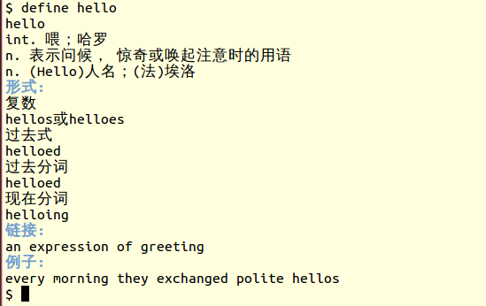

# linux/unix utils

## Overview
This repo contains a bunch of utils for linux and/or unix systems.

## Installation

```
$ git clone git@github.com:oxnz/nix-utils.git
$ cd nix-utils
$ ./configure
$ make install
```

## Usage

tool name | description | platform
:--------:|:-----------:|:--------:
gnu-apt | a perl script used to list and fetch tar balls from ftp.gnu.org | nix
live-hosts | a script used to find out live hosts in LAN | nix
jre-install | a shell script intend for automated install jre or jdk | linux
unix2dos & dos2unix | convert text file format | nix
tomcatctl | a script can be used to control tomcat server like start\|stop\|restart| nix
tomcatctl.bash\_completion | bash completion script for tomcatctl | nix
jre-install | install jre and make soft link to Mozilla folder, etc | linux
git-setup | setup git environment | nix
update-nvidia | auto complie nvidia kernel module after each time of kernel update [(Link)](http://ubuntuforums.org/showthread.php?t=835573) | linux
postinstall-[freebsd, ubuntu] | postinstall actions | nix
backup | backup script | nix
brew | homebrew like ruby script which could show the instructions to manual install each software | osx
bird | a small dns server | nix
define | a program to lookup english words definition from internet | nix
free | show memory usage statistics on osx | oxs
rmbom | remove software installs on osx | osx
ipinfo | get info for IP | nix

## Screenshots

### ipinfo

```
$ ipinfo
ip       => 119.32.139.201
hostname => No Hostname
city     => Guangdong
region   => Jilin
country  => CN
loc      => lat: 129.3364, lon: 42.7683
org      => AS17622 China Unicom Guangzhou network
$
```

### define



## Contributing

Once you've made your great commits:

1. [Fork][fk] Mustache
2. Create a topic branch - `git checkout -b my_branch`
3. Push to your branch - `git push origin my_branch`
4. Create an [Issue][is] with a link to your branch
5. That's it!

You might want to checkout Resque's [Contributing][cb] wiki page for information
on coding standards, new features, etc.

Alternatively if you find a bug, you can [open an issue][is].


[cb]: http://wiki.github.com/oxnz/nix-utils/contributing
[fk]: http://help.github.com/forking/
[is]: https://github.com/oxnz/nix-utils/issues
